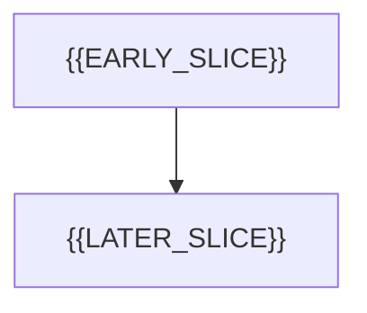

# Open FRED Index — {{INDEX_SUBTITLE}}

> **Updated:** {{DATE}} — {{STATUS_BLURB}}
>
> This index owns IDs, dependencies, and status. {{ROADMAP_DOC_OR_N_A}} owns batches if used. [Entrypoint](../agent-guides/00-AGENT-ENTRYPOINT.md) owns contributor workflow. {{ARCHITECTURE_DOC}} owns local layout/stack law.

**Next FRED number:** `{{NEXT_NNN}}`. **Open:** {{OPEN_COUNT}}. **Implemented:** {{IMPLEMENTED_COUNT}} (link closed files under `./implemented/`).

## Open work in execution order

Filename number is stable identity, not implementation order. Rows should be a valid dependency order; independent batches may use fakes/prototypes only when named.

| FRED | Source ID | Local stage | Depth | Dependencies | Action / Remaining work |
| --- | --- | --- | --- | --- | --- |
| [{{NNN}} — {{Title}}](./{{NNN}}-{{slug}}.md) | {{SOURCE_OR_LOCAL}} | {{STAGE}} | Draft / Detailed | {{DEPS}} | KEEP OPEN — refine/implement/verify |

## Dependency overview

Rewrite this diagram for **this** product. Do not copy another repo’s sequence.

## Working gates

{{FOUNDATION_GATE}}

{{RELEASE_OR_INTEGRATION_GATE}}

## Recently closed / superseded

| FRED | Closed | Notes |
| --- | --- | --- |
| | | |

Completed history belongs in [implemented/](./implemented/).

## Maintaining FREDs

1. Allocate next number, follow [template](./template.md), add a row, increment **Next FRED number**.
2. Keep IDs stable; update dependencies and depth together.
3. Before implementation, fill feature-owned contracts against actual dependencies.
4. Record verification and blocked runtime/account probes honestly.
5. When shipped: move to `implemented/`, repair relative links, remove the open row, retain historical decisions.
